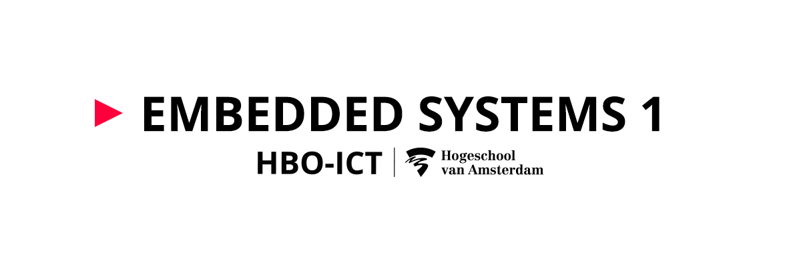
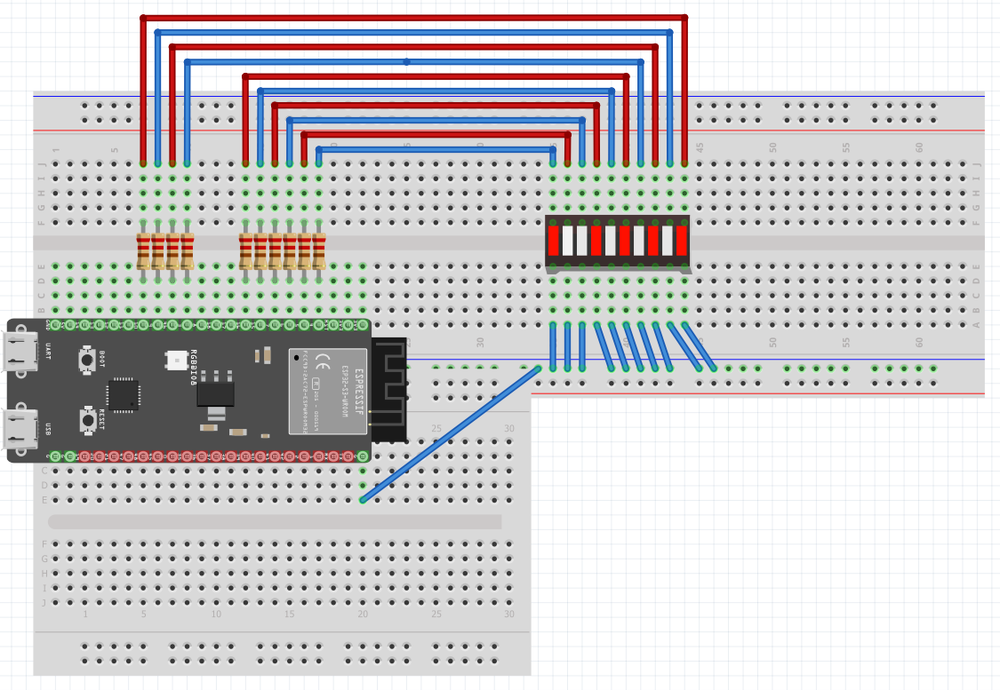
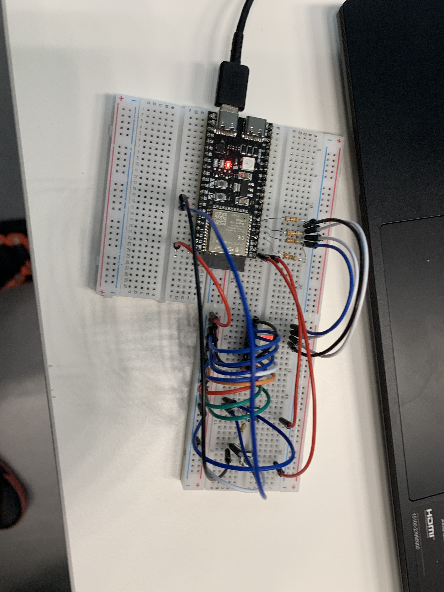
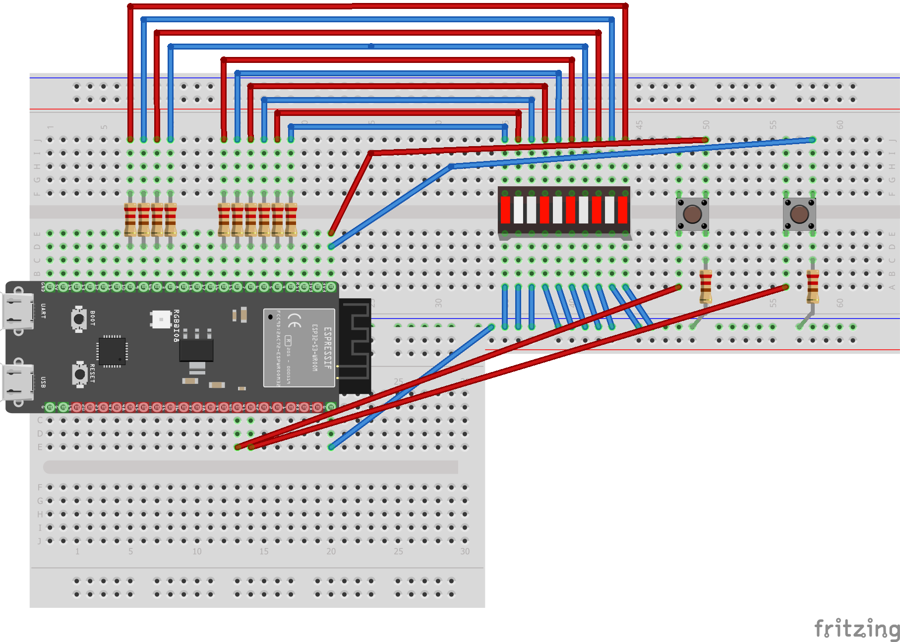

# 

## Binair Led bar teller opdracht 2

    /*
    Melvin Moes
    24-11-2022
    Binary counting program with leds
    */
    //Importing gpio drivers
    #include "freertos/FreeRTOS.h"
    #include "freertos/task.h"
    #include "driver/gpio.h"

    //Defining the Led Pin 
    int LED_PIN[10] = {4, 5, 6, 7, 15, 16, 3, 46, 9, 10};
    #define HIGH 1
    #define LOW 0
    #define DELAY 1000 // 1000 milliseconde = 1 seconde

    //Main code
    void app_main() {
        //Max number it can count to using 10 leds
        int maxWaarde = 1024;

        //Setting power direction for every single led
        for (size_t i = 0; i < 10; i++)
        {
            gpio_set_direction(LED_PIN[i], GPIO_MODE_OUTPUT);
        }

        //Counting in binary using byte shifting
        for (size_t x = 0; x < maxWaarde; x++)
        {
            for (size_t i = 0; i < 10; i++)
            {
                //Checking every position in the 10 byte long number if the placement is a number higher than 0 led turns on
                if (((1 << i) & x) >= 1)
                {
                    printf("1");
                    gpio_set_level(LED_PIN[i], HIGH);
                } else {
                    printf("0");
                    gpio_set_level(LED_PIN[i], LOW);
                }
            }
            printf("\n");
            //Adding a delay for the count
            vTaskDelay(DELAY / portTICK_PERIOD_MS);
        }
    }  

## Week 2 vragen

- Schrijf de decimale waarde 127 in binair en hexadecimaal (zonder rekenmachine).

> Binair: "1111111" 1+2+4+8+16+64+32=96=127 Hexadecimaal: "7f" 127/16 = 7 rest is 15=f

- Zet het decimale getal -24 om in de binaire waarde, schrijf deze op in de vorm van 8-bit two's complement.

> "11000" = 24 (FLIP en 1 bijvoegen) = "100011"

- Wat zijn de verschillende representaties voor decimale, binaire en hexadecimale getallen? Hoe gebruik je deze in C?

> Ze hebben allemaal een ander grondgetal namelijk decimaal(10) binair(2) hexadecimaal(16)

- Beschrijf de werking van een flipflopschakeling, waarom is deze zo belangrijk voor computersystemen?

> .
