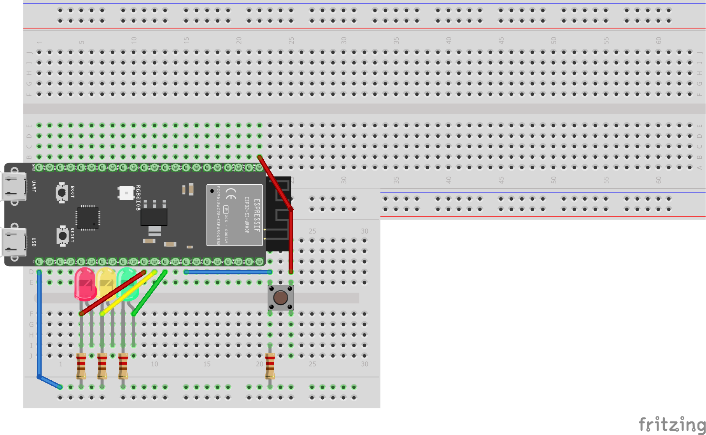

# 

## Stoplicht Opdracht 3

## Gemaakt door: Melvin Moes, 500905603

```python
/*
Melvin Moes
06-12-2022
Stoplicht simuleren met 3 leds
*/
#include "freertos/FreeRTOS.h"
#include "freertos/task.h"
#include "driver/gpio.h"

#define HIGH 1
#define LOW 0

//Defining all led pins
#define BUTTON 40
#define R_LED 36
#define Y_LED 37
#define G_LED 38

//Function to turn off one led and turn on another
void powerOnOff(int LED_ONE, int LED_TWO){
    gpio_set_level(LED_ONE, LOW);
    gpio_set_level(LED_TWO, HIGH);
    vTaskDelay(1000 / portTICK_PERIOD_MS);
}

void app_main() {
    //Setting power direction for the LED's
    gpio_set_direction(R_LED, GPIO_MODE_OUTPUT);
    gpio_set_direction(Y_LED, GPIO_MODE_OUTPUT);
    gpio_set_direction(G_LED, GPIO_MODE_OUTPUT);

    //Setting power direction for the button
    gpio_set_direction(BUTTON, GPIO_MODE_INPUT);

    //Making red led turn on, on boot
    gpio_set_level(R_LED, HIGH);

    while (true)
    {
        //If button pressed execute code
        if(gpio_get_level(BUTTON) == HIGH){
            vTaskDelay(1000 / portTICK_PERIOD_MS);

            //Turn off red led, turn on green led
            powerOnOff(R_LED, G_LED);

            //Turn off green led, turn on yellow led
            powerOnOff(G_LED, Y_LED);

            //Turn off yellow led, turn on red led (end of cycle)
            powerOnOff(Y_LED, R_LED);
            }
    }
    
}
```

Hier boven in de code zie je een simpele manier om een stoplicht te simuleren. Ik heb een functie aangemaakt die 1 lampje uit zet en 1 aanzet. Deze functie gebruik ik later om dan steeds precies dit te doen. Een stoplicht heeft namelijk altijd maar 1 van de lampen aan. Dus er moet er altijd weer 1 uit gaan.




## Week 3 vragen
